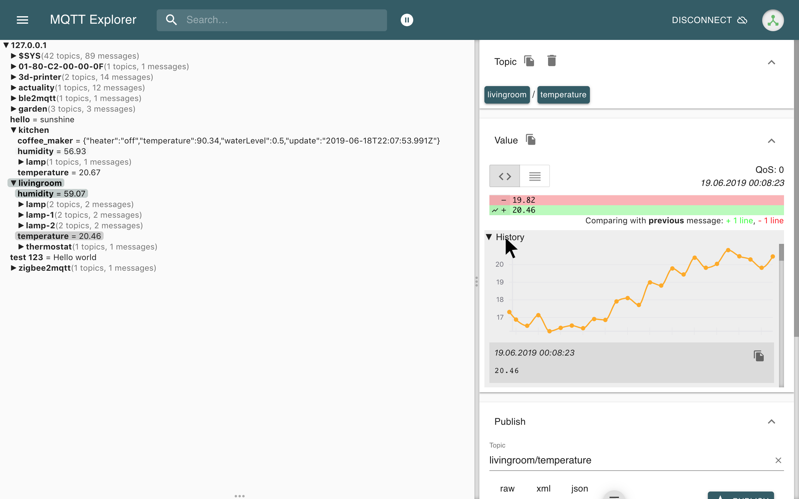

# Actividad de laboratorio 1

> ## Objetivos
> * Comprender las principales caracteristicas de la capa de percepción.
> * Instalar y probar el software necesario para trabajar conceptos asociados a la capa de percepción.
> * Conocer el Hardware disponible en el laboratorio.

## Introducción

Dentro de la arquitectura IoT se concibe como una arquitectura de 3 capas: percepción, red y aplicación. 

Tal y como en la grafica anterior, la capa de percepción hace referencia a aquella capa de la arquitectura encargada de interactuar con el medio. Luego, a medida que avance el curso, veremos mas sobre esta. Por ahora, nuestro objetivo consistirá en determinar el software y hardware que se requeriran para la parte del curso que involucra esta capa.  

### Software

El software que será necesario instalar para esta parte del curso se lista a continuación:
 
1. Instale el IDE de arduino [link](https://www.arduino.cc/en/software). Este entorno de desarrollo será empleado en la parte inicial del curso para codificar programas para la plataforma arduino.
   
    
   
2. Cree una cuenta en github ([link](https://github.com/)), sera necesaria para el desarrollo de los proyectos y algunas actividades del curso.

    

3. Cree una cuenta en Tinkercad ([link](https://www.tinkercad.com/)), esta plataforma web será sumamente util para prototipar y simular proyectos de arduino antes de realizar el montaje en fisico.
   
   

4. Descargue e instale el Fritzing ([link](https://fritzing.org/)), esta plataforma permitira prototipar hardware en su computador y verificar su funcionamiento antes de hacer el montaje en fisico.
   
   

5. Instale en Node-RED ([link](https://nodered.org/)), esta es una herramienta de programación que emplearemos en el curso para realizar prototipado rapido de aplicaciones.
   
    
   
6. Instale el Visual Studio Code ([link](https://nodered.org/)), este editor de codigo fuente ampliamente versatil será empleado para desarrollo de programas de aplicación para las plataformas de hardware que se emplearan para prototipado en el curso.
    
    

7. Instale el platformio ([link](https://platformio.org/)), este pluging de visual studio code será empleado para programar diferentes plataformas de desarrollo como el ESP8266 y la Raspberry pi.
   
   

8. Instale el draw.io ([link](https://chrome.google.com/webstore/detail/diagramsnet-desktop/pebppomjfocnoigkeepgbmcifnnlndla?hl=en-GB)) esta se puede instalar como complemento en google o de manera local en windows ([link](https://www.microsoft.com/en-us/p/drawio-diagrams/9mvvszk43qqw?activetab=pivot:overviewtab)), podrá ser utilizada para realizar todo tipo de diagramas a lo largo del curso.
   

   

9.  Realizar la instalación del mosquitto ([link](https://mosquitto.org/)), este broker MQTT opensource sera ampliamente empleado mas adelante en el curso principalmente cuando se estudien las capas de red y aplicación.

    
   
10. Instale el Mqtt explorer ([link](http://mqtt-explorer.com/)), este cliente MQTT facilitara el proceso de debug de las aplicaciónes IoT que usan el protocolo MQTT para comunicar las cosas.

    
      

### Hardware

## Referencias

1. https://upcommons.upc.edu/bitstream/handle/2117/100921/LM08_R_ES.pdf
2. https://redesmoviles.com/iot/arquitecturas-iot/
   

